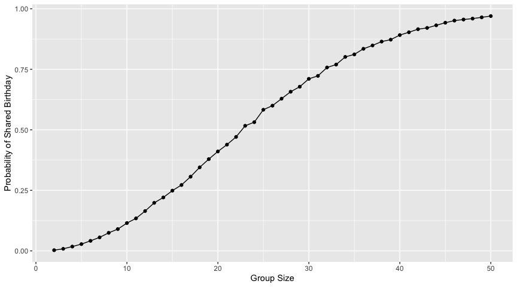
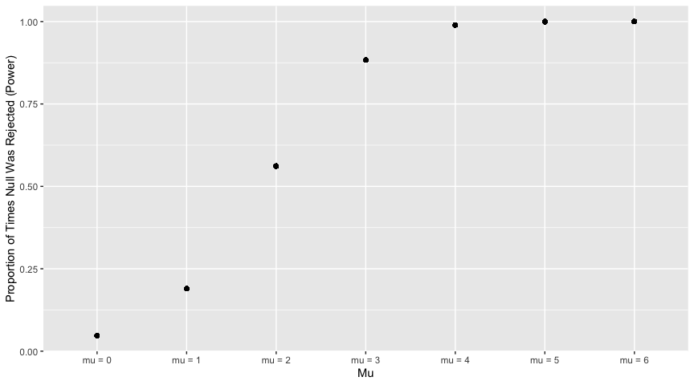
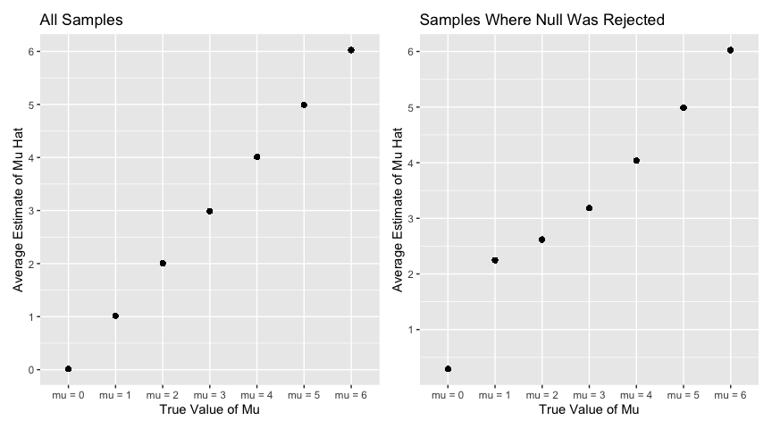
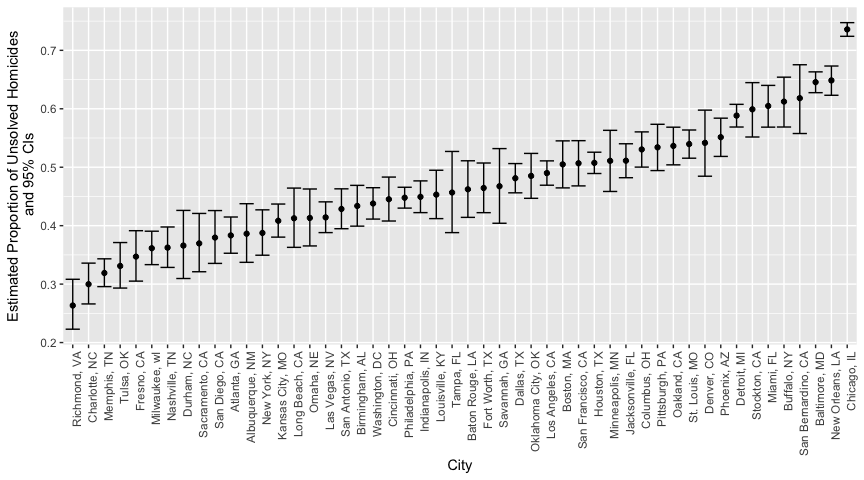

p8105_hw5_ksf2129
================
Kimia Faroughi
2025-11-13

Load packages

``` r
library(tidyverse)
library(patchwork)
```

## Problem 1

Function that randomly draws “birthdays” for each person in a fixed
group size.

``` r
bday_sim = function (n_room) {
  
  birthdays = sample(1:365, n_room, replace = TRUE)

  #if number of unique birthdays is < n_room (there is a repeated bday) this will return as true
  repeated_bday = length(unique(birthdays)) < n_room
  
  repeated_bday
  
}
```

Run function 10000 times for each group size between 2 and 50.

``` r
bday_sim_results =
  expand_grid(
    bdays = 2:50, #number of people in the room
    iter = 1:10000 #number of simulation runs
  ) |> 
  mutate(
    result = map_lgl(bdays, bday_sim) #iterate
  ) |> 
  group_by(
    bdays
  ) |> 
  summarize(
    prob_repeat = mean(result) #probability at least two people in group share a birthday (avg across simulation runs)
  )
```

Plot showing probability as function of group size.

``` r
bday_sim_results |> 
  ggplot(aes(x = bdays, y = prob_repeat)) +
  geom_point() +
  geom_line() +
  labs(
    x = "Group Size",
    y = "Probability of Shared Birthday"
  )
```

<!-- -->

The plot shows that as group size increases, the probability that at
least two people in the group share a birthday also increases. By the
time the group consists of 50 people, this probability is close to 1,
whereas when the group consists of 2 people the probability is close to
0.

## Problem 2

Write function to simulate data

``` r
sim_mean_sd = function(mu, n_subj = 30, sigma = 5) { #fix n and sigma
  
  sim_df = 
    tibble(
      x = rnorm(mean = mu, n = n_subj, sd = sigma) #normal distribution
    )
  
  sim_df |> 
    summarize(
      mu_hat = mean(x), 
      p_value = t.test(x) |> broom::tidy() |> pull(p.value) #default significance level 0.05, mu 0
    )
  
}
```

Set mu = 0 and generate 5000 datasets

``` r
sim_results_0_df = 
  expand_grid(
    mu = 0,
    iter = 1:5000
  ) |> 
  mutate(
    results = map(mu, sim_mean_sd)
  ) |> 
  unnest(results)
```

Do this for mu = 1:6

``` r
sim_results_df = 
  expand_grid(
    mu = 0:6,
    iter = 1:5000
  ) |> 
  mutate(
    results = map(mu, sim_mean_sd)
  ) |> 
  unnest(results)
```

Plot showing proportion of times null was rejected vs. true value of mu

``` r
sim_results_df |> 
  group_by(mu) |>
  mutate(
    mu = str_c("mu = ", mu),
    reject = p_value < 0.05,
    prop_reject = mean(reject) #proportion that are true (p-value < 0.05) for each mu
  ) |>
  ggplot(aes(x = mu, y = prop_reject)) +
  geom_point() +
  labs(
    x = "Mu",
    y = "Proportion of Times Null Was Rejected (Power)"
  )
```

<!-- -->

As effect size increases (distance of mu from 0), the power of the test
(proportion of times the null hypothesis is rejected) also increases.

Plot of true value of mu vs average estimate of mu hat

``` r
all_plot =
  sim_results_df |> 
    group_by(mu) |> 
    mutate(
      mu = str_c("mu = ", mu),
      estimated_mu_hat = mean(mu_hat)
    ) |> 
    ggplot(aes(x = mu, y = estimated_mu_hat)) +
    geom_point() +
    labs(
      x = "True Value of Mu",
      y = "Average Estimate of Mu Hat",
      title = "All Samples"
    ) +
    scale_y_continuous(breaks = c(0, 1, 2, 3, 4, 5, 6))
```

Plot of true value of mu vs average estimate of mu only in samples where
null was rejected

``` r
sig_plot =
  sim_results_df |> 
    filter(p_value < 0.05) |>
    group_by(mu) |> 
    mutate(
      mu = str_c("mu = ", mu),
      estimated_mu_hat = mean(mu_hat)
    ) |> 
    ggplot(aes(x = mu, y = estimated_mu_hat)) +
    geom_point() +
    labs(
      x = "True Value of Mu",
      y = "Average Estimate of Mu Hat",
      title = "Samples Where Null Was Rejected"
    ) +
    scale_y_continuous(breaks = c(0, 1, 2, 3, 4, 5, 6))
```

Patchwork

``` r
mu_hat_plots = (all_plot + sig_plot)
mu_hat_plots
```

<!-- -->

The sample average of mu hat across tests for which the null is rejected
(p-value \< 0.05) is not approximately equal to the true value of mu,
especially for when the true value of mu is from 0-3. This is because
tests where the null was rejected represent values of mu hat that are
very unlikely to be consistent with an underlying distribution where the
true value of mu is 0. As mu increases, the effect size increases which
means the power of the test to result in the rejection of a false null
hypothesis increases. This means that for true values of mu further from
0, the test has greater power to reject the null hypothesis that mu = 0,
making the average estimate of mu hat closer to the actual value of mu.

## Problem 3

Describe raw data

``` r
homicides_df = 
  read_csv("data/homicide-data.csv")

homicides_df
```

    ## # A tibble: 52,179 × 12
    ##    uid        reported_date victim_last  victim_first victim_race victim_age
    ##    <chr>              <dbl> <chr>        <chr>        <chr>       <chr>     
    ##  1 Alb-000001      20100504 GARCIA       JUAN         Hispanic    78        
    ##  2 Alb-000002      20100216 MONTOYA      CAMERON      Hispanic    17        
    ##  3 Alb-000003      20100601 SATTERFIELD  VIVIANA      White       15        
    ##  4 Alb-000004      20100101 MENDIOLA     CARLOS       Hispanic    32        
    ##  5 Alb-000005      20100102 MULA         VIVIAN       White       72        
    ##  6 Alb-000006      20100126 BOOK         GERALDINE    White       91        
    ##  7 Alb-000007      20100127 MALDONADO    DAVID        Hispanic    52        
    ##  8 Alb-000008      20100127 MALDONADO    CONNIE       Hispanic    52        
    ##  9 Alb-000009      20100130 MARTIN-LEYVA GUSTAVO      White       56        
    ## 10 Alb-000010      20100210 HERRERA      ISRAEL       Hispanic    43        
    ## # ℹ 52,169 more rows
    ## # ℹ 6 more variables: victim_sex <chr>, city <chr>, state <chr>, lat <dbl>,
    ## #   lon <dbl>, disposition <chr>

The raw data shows 12 variables describing a unique identifier, reported
date of homicide, the victim’s first and last name, race, age, sex,
city, state, latitude and longitude, and disposition (the status of the
case and perpetrator). These are described for 52179 observations.

Create variable for city + state

``` r
#create city_state
homicides_df =
  homicides_df |> 
  mutate(city_state = str_c(city, state, sep = ", ")) |> 
  filter(city_state != "Tulsa, AL") #remove Tulsa, AL
```

Summarize total homicides and unsolved homicides within cities

``` r
homicides_df |> 
  group_by(city_state) |> 
  summarize(
    total_homicides = n(),
    number_unsolved = sum(disposition == "Closed without arrest" | disposition == "Open/No arrest")
  ) |> 
  knitr::kable() #there is Tulsa, AL with just 1 obs, remove that above
```

| city_state         | total_homicides | number_unsolved |
|:-------------------|----------------:|----------------:|
| Albuquerque, NM    |             378 |             146 |
| Atlanta, GA        |             973 |             373 |
| Baltimore, MD      |            2827 |            1825 |
| Baton Rouge, LA    |             424 |             196 |
| Birmingham, AL     |             800 |             347 |
| Boston, MA         |             614 |             310 |
| Buffalo, NY        |             521 |             319 |
| Charlotte, NC      |             687 |             206 |
| Chicago, IL        |            5535 |            4073 |
| Cincinnati, OH     |             694 |             309 |
| Columbus, OH       |            1084 |             575 |
| Dallas, TX         |            1567 |             754 |
| Denver, CO         |             312 |             169 |
| Detroit, MI        |            2519 |            1482 |
| Durham, NC         |             276 |             101 |
| Fort Worth, TX     |             549 |             255 |
| Fresno, CA         |             487 |             169 |
| Houston, TX        |            2942 |            1493 |
| Indianapolis, IN   |            1322 |             594 |
| Jacksonville, FL   |            1168 |             597 |
| Kansas City, MO    |            1190 |             486 |
| Las Vegas, NV      |            1381 |             572 |
| Long Beach, CA     |             378 |             156 |
| Los Angeles, CA    |            2257 |            1106 |
| Louisville, KY     |             576 |             261 |
| Memphis, TN        |            1514 |             483 |
| Miami, FL          |             744 |             450 |
| Milwaukee, wI      |            1115 |             403 |
| Minneapolis, MN    |             366 |             187 |
| Nashville, TN      |             767 |             278 |
| New Orleans, LA    |            1434 |             930 |
| New York, NY       |             627 |             243 |
| Oakland, CA        |             947 |             508 |
| Oklahoma City, OK  |             672 |             326 |
| Omaha, NE          |             409 |             169 |
| Philadelphia, PA   |            3037 |            1360 |
| Phoenix, AZ        |             914 |             504 |
| Pittsburgh, PA     |             631 |             337 |
| Richmond, VA       |             429 |             113 |
| Sacramento, CA     |             376 |             139 |
| San Antonio, TX    |             833 |             357 |
| San Bernardino, CA |             275 |             170 |
| San Diego, CA      |             461 |             175 |
| San Francisco, CA  |             663 |             336 |
| Savannah, GA       |             246 |             115 |
| St. Louis, MO      |            1677 |             905 |
| Stockton, CA       |             444 |             266 |
| Tampa, FL          |             208 |              95 |
| Tulsa, OK          |             583 |             193 |
| Washington, DC     |            1345 |             589 |

Run `prop.test` for Baltimore, MD

``` r
baltimore_df = 
  homicides_df |> 
  filter(city_state == "Baltimore, MD") |> 
  summarize(
    total_homicides = n(),
    number_unsolved = sum(disposition == "Closed without arrest" | disposition == "Open/No arrest")
  )

baltimore_test = 
  prop.test(baltimore_df |> pull(number_unsolved), baltimore_df |> pull(total_homicides))

baltimore_tidy = broom::tidy(baltimore_test)

unname(baltimore_tidy |> pull(estimate))
```

    ## [1] 0.6455607

``` r
baltimore_tidy |> pull(conf.high)
```

    ## [1] 0.6631599

``` r
baltimore_tidy |> pull(conf.low)
```

    ## [1] 0.6275625

Run this for each city in the dataset

``` r
#create new df with relevant vars
cities_df = 
  homicides_df |> 
  group_by(city_state) |> 
  summarize(
    total_homicides = n(),
    number_unsolved = sum(disposition == "Closed without arrest" | disposition == "Open/No arrest")
  )

#nest so new df of relevant info for each city
cities_nest =
  cities_df |> 
  nest(data = total_homicides:number_unsolved)
```

``` r
#create function
cities_test = function(df) {
  
  test = 
    prop.test(df |> pull(number_unsolved), df |> pull(total_homicides))
  
  tidy_test = broom::tidy(test)
  
  results_df =
    tidy_test |> 
    mutate(
      prop_unsolved = unname(estimate),
      lower_ci = conf.high,
      upper_ci = conf.low
    ) |> 
    select(prop_unsolved, lower_ci, upper_ci)
  
  return(results_df)
  
}
```

``` r
#map
unsolved_cities =
  cities_nest |> 
    mutate(
      cities_results = map(data, cities_test)
    ) |> 
    unnest()
```

Plot with estimates and CIs for each city

``` r
unsolved_cities |> 
  mutate(
    city_state = fct_reorder(city_state, prop_unsolved)
  ) |> 
  ggplot(aes(x = city_state, y = prop_unsolved)) +
  geom_point() +
  geom_errorbar(aes(ymin = lower_ci, ymax = upper_ci)) +
  theme(axis.text.x = element_text(angle = 90, hjust = 1, vjust = 1)) +
  labs(
      x = "City",
      y = "Estimated Proportion of Unsolved Homicides\n and 95% CIs",
    ) 
```

<!-- -->
